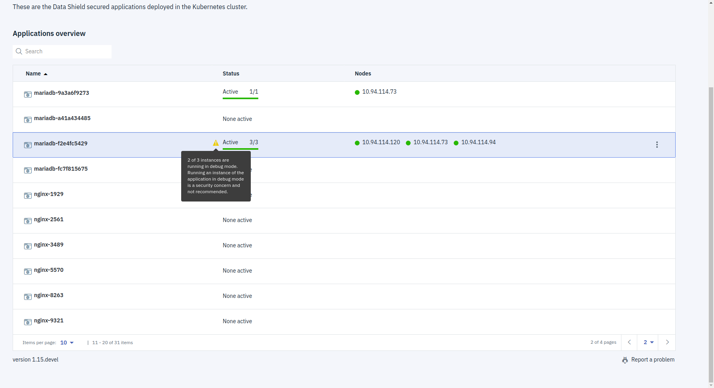
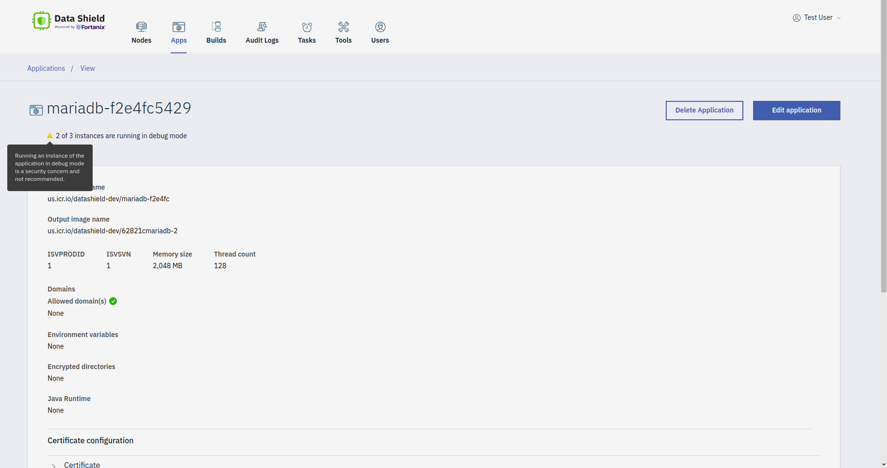
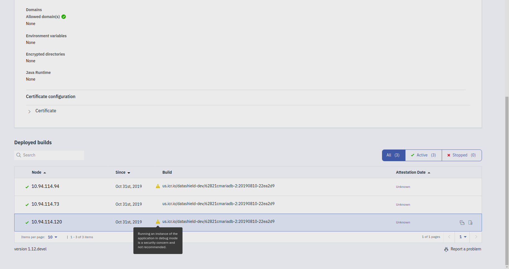

---
copyright:
  years: 2018, 2020
lastupdated: "2020-02-04"

keywords: enclave manager, convert container, cluster, deploy app, certificates, app security, node attestation, ingress, subdomain, build app, memory allocation, data protection, data in use, encryption, encrypted memory,

subcollection: data-shield
---

{:external: target="_blank" .external}
{:shortdesc: .shortdesc}
{:screen: .screen}
{:pre: .pre}
{:table: .aria-labeledby="caption"}
{:codeblock: .codeblock}
{:tip: .tip}
{:note: .note}
{:important: .important}
{:deprecated: .deprecated}
{:download: .download}

# Deploying apps with the Enclave Manager
{: #enclave-manager}

You can use the Enclave Manager UI to manage the applications that you protect with {{site.data.keyword.datashield_full}}. From the UI you can manage your app deployment, assign access, handle whitelist requests, and convert your applications.
{: shortdesc}


## Signing in
{: #em-signin}

In the Enclave Manager console, you can view the nodes in your cluster and their attestation status. You can also view tasks and an audit logs of cluster events. To get started, sign in.
{: shortdesc}

The first time that you sign in to the Enclave Manager, it must be done by using the same email and account ID that were used to install {{site.data.keyword.datashield_short}} on the cluster.
{: tip}

1. Be sure that you have the [correct access](/docs/data-shield?topic=data-shield-access).

2. Log in to the {{site.data.keyword.cloud_notm}} CLI. Follow the prompts in the CLI to complete logging in. If you have a federated ID, append the `--sso` option to the end of the command.

  ```
  ibmcloud login
  ```
  {: codeblock}

3. Set the context for your cluster.

  1. Get the command to set the environment variable and download the Kubernetes configuration files.

    ```
    ibmcloud ks cluster-config <cluster_name_or_ID>
    ```
    {: codeblock}

  2. Copy the output beginning with `export` and paste it into your terminal to set the `KUBECONFIG` environment variable.

4. Check to see that all your service is running by confirming that all of your pods are in an *active* state.

  ```
  kubectl get pods
  ```
  {: codeblock}

5. Get your Ingress subdomain.

  ```
  ibmcloud ks cluster-get <your-cluster-name>
  ```
  {: codeblock}

6. In a browser, enter the Ingress subdomain where your Enclave Manager is available.

  ```
  enclave-manager.<cluster-ingress-subdomain>
  ```
  {: codeblock}

7. In terminal, get your IAM token.

  ```
  ibmcloud iam oauth-tokens
  ```
  {: codeblock}

8. Copy the just the alpha-numeric portion of the token and paste it into the Enclave Manager GUI. You do not need to copy the word `Bearer`.

9. Click **Sign in**.


## Managing nodes
{: #em-nodes}

You can use the Enclave Manager UI to monitor the status, deactivate, or download the certificates for nodes that run IBM Cloud Data Shield in your cluster.
{: shortdesc}


1. [Sign in](/docs/data-shield?topic=data-shield-enclave-manager#em-signin) to the Enclave Manager.

2. Go to the **Nodes** tab.

3. Click the IP address of the node that you want to investigate. An information screen opens.

4. On the information screen, you can choose to remove the node from your whitelist by clicking **Delist node** or you can download the certificate that is used for attestation.


## Adding an app
{: #em-app-add}

You can convert, deploy, and whitelist your application all at the same time by using the Enclave Manager UI.
{: shortdesc}

1. [Sign in](/docs/data-shield?topic=data-shield-enclave-manager#em-signin) to the Enclave Manager and go to the **Apps** tab.

2. Click **Add new application**.

3. Give your application a name and description.

4. Enter the input and output name for your images. The input is the name of your registry and image without the Docker tag. The Docker tag is added when the app is built. The output is the name of the registry and image where you want to send the converted application.

5. Enter an **ISVPRDID**. It is a numeric product identifier that you assign to the enclave. You can choose a unique value in range 0 - 65,535.

6. Enter an **ISVSVN**. It is a numeric security version that you assign to the enclave. When you make a change that affects your application security, be sure to incrementally increase the value.

7. Provide a memory size for your Enclave. If your application uses a large amount of memory, you can use a large enclave. However, the size of your enclave can affect your performance. Be sure that your memory allocation is set to a power of 2. For example: `2048 MB`.

8. Enter a number of threads for your enclave that is large enough to accommodate the maximum number of processes that run in your app.

6. Enter any allowed domains.

7. Edit any advanced settings that you might want to change. For more information about the certificate configuration options, see [Configuring certificates](/docs/data-shield?topic=data-shield-enclave-manager#em-certificate).

8. Click **Add**. The application added to your list of available applications. To deploy your app, create a build and then approve the build request in the **tasks** tab.


### Configuring certificates
{: #em-certificate}

A converted application can request a certificate from {{site.data.keyword.datashield_short}} when the app is started. The certificates are signed by the {{site.data.keyword.datashield_short}} certificate authority, which issues certificates only to enclaves that present valid attestation.

1. In the certificate configuration field, provide the information as outlined in the following table.

  <table>
    <caption>Table 1. Certificate configuration options</caption>
    <tr>
      <th>Configuration option</th>
      <th>Description</th>
    </tr>
    <tr>
      <td>Key path</td>
      <td>The path to the key that is accessible by the application. For example: <code>/etc/nginx/nginx-key.pem</code></td>
    </tr>
    <tr>
      <td>Certificate path</td>
      <td>The path to the certificate that is accessible by the application. For example: <code>/etc/nginx/nginx-cert.pem</code></td>
    </tr>
    <tr>
      <td>Optional: CA cert path</td>
      <td>The path to store the {{site.data.keyword.datashield_short}} CA certificate. For example: <code>/etc/cacert.pem</code>.</td>
    </tr>
    <tr>
      <td>Optional: Chain path</td>
      <td>The path for the complete certificate chain.</td>
    </tr>
    <tr>
      <td>Subject</td>
      <td>The subject, as shown in the Allowed domains list.</td>
    </tr>
  </table>

2. Choose from the following options whether to install the CA certificate in the system truststore with all of the other certificates.

  * **Yes, install and continue build conversion even if the installation fails**: Allows the build conversion to complete even if the certificate installation fails.
  * **Yes, install and fail build conversion if the installation fails**: Stops the build conversion if the certificate installation fails.
  *	**No, do not install**: Does not install the certificate.


## Editing an app
{: #em-app-edit}

You can edit an application after you add it to your list.
{: shortdesc}


1. [Sign in](/docs/data-shield?topic=data-shield-enclave-manager#em-signin) to the Enclave Manager and go to the **Apps** tab.

2. Click the name of the application that you want to edit. A new screen opens where you can review the configuration including certificates and deployed builds.

3. Click **Edit application**.

4. Update the configuration. Be sure that you understand the way that changing the advanced settings affects your application before you make any changes.

5. Click **Update application**.

## Check if an application is production signed or not
{: #em-app-prod}

You can view the number of application instances that are currently running and how many of these instances are running with debug mode.
{: shortdesc}

An application that is running with debug mode is a security concern and not recommended.
{: important}

To view the application instances running with debug mode:
1. [Sign in](/docs/data-shield?topic=data-shield-enclave-manager#em-signin) to the IBM Cloud Data Shield and go to the **Apps** tab.
2. There are two ways to view  the application instances that are running in debug mode:
   * In the **Applications overview** table, under the Status column for each application, you will see a Warning icon. Click the Warning icon to view  the number of application instances that are running in debug mode, or
   {: caption="Figure 1. Application instances running in debug mode" caption-side="bottom"}
   * Click the application itself to go to the detailed view of an application to view the number of application instances running in debug mode. To do this:
   a. In the detailed view of an application, click the Warning icon below the name of the application.
      {: caption="Figure 2. Application detailed view" caption-side="bottom"}

3. To view the application instances, scroll to the bottom of the application detailed view page. The *Deployed builds* table lists the instances of the application. In the *Build* column for an application instance, notice that there is a Warning icon that denotes that the application is running in debug mode.
{: caption="Figure 3. Application instances" caption-side="bottom"}

## Building applications
{: #em-builds}

You can use the Enclave Manager UI to rebuild your applications after you make changes.
{: shortdesc}

1. [Sign in](/docs/data-shield?topic=data-shield-enclave-manager#em-signin) to the Enclave Manager and go to the **Builds** tab.

2. Click **Create new build**.

3. Select an application from the drop-down list or click **[add an application](/docs/data-shield?topic=data-shield-enclave-manager#em-app-add)** to go to the app tab.

4. Enter the name of your Docker image and tag it with a label.

5. Click **Create**. The build is added to your whitelist. You can approve the build in the **Tasks** tab.


## Approving tasks
{: #em-tasks}

When an application is whitelisted, it is added to the list of pending requests in the **Tasks** tab of the Enclave Manager UI. You can use the UI to approve or deny the request.
{: shortdesc}

1. [Sign in](/docs/data-shield?topic=data-shield-enclave-manager#em-signin) to the Enclave Manager and go to the **Tasks** tab.

2. Click the row of the request that you want to approve or deny. A screen with more information opens.

3. Review the request and click **Approve** or **Deny**. Your name is added to the list of **Reviewers**.


## Viewing logs
{: #em-view}

You can audit your Enclave manager instance for several different types of activity.
{: shortdesc}

1. Go to the **Audit log** tab of the Enclave Manager UI.
2. Filter the logging results to narrow your search. You can choose to filter by timeframe or by any of the following types.

  * App status: Activity that pertains to your application such as whitelist requests and new builds.
  * User approval: Activity that pertains to a user's access such as their approval or denial to use the account.
  * Node attestation: Activity that pertains to node attestation.
  * Certificate authority: Activity that pertains to a certificate authority.
  * Administration: Activity that pertains to administration.

If you want to keep a record of the logs beyond 1 month, you can export the information as a `.csv` file.
{: tip}
